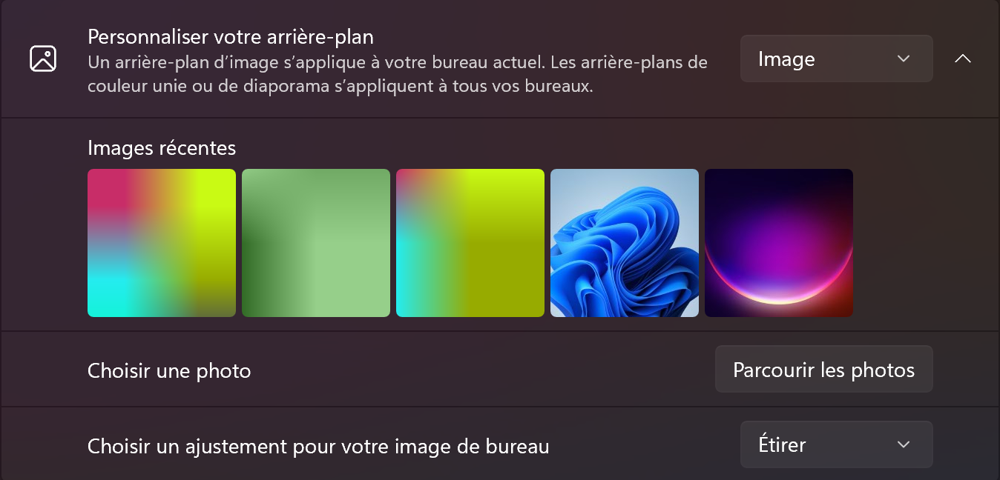

# dataInImage

## Encoding/decoding

Ce projet permet de générer des images multicolores à base de textes, ce qui permet de "cacher" des messages sous forme d'images.


Cette image correspond par exemple au livre "alice au pays des merveilles".

Ce projet permet aussi de récupérer le message caché dans une image.

## BG_Changing

Ce projet permet de générer des fonds d'écran aléatoires qui changent selon un interval donné.
Il faut dans les paramètres windows que la section *Personnaliser votre arrière-plan* soit sur *Image*.
Je recommande la section *Choisir un ajustement pour votre image de bureau* soit sur *Étirer* bien que vous pouvez l'ajuster selon vos goûts.


### Setup

- créer un .env
- ajouter la variable "BG_PATH" et indiquer le chemin ou sera généré le background

Vous pouvez ajouter les variables *X_LENGTH*, *Y_LENGTH* et *TIME_BEFORE_BG_CHANGE* afin que le programme puisse être exécuté automatiquement au démarrage. Il vous faudra aussi ajouter le fichier *startup.bat* dans le dossier de démarrage de windows.

Appuyer sur *Win+r* puis entrez *shell:startup* et coller le fichier dedans.

```.env
BG_PATH=C:/users/Me/background
```
